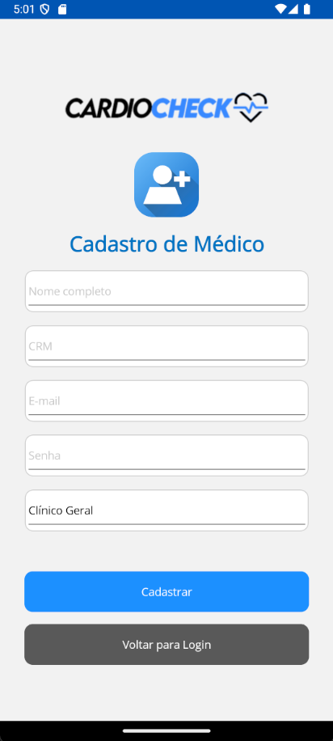
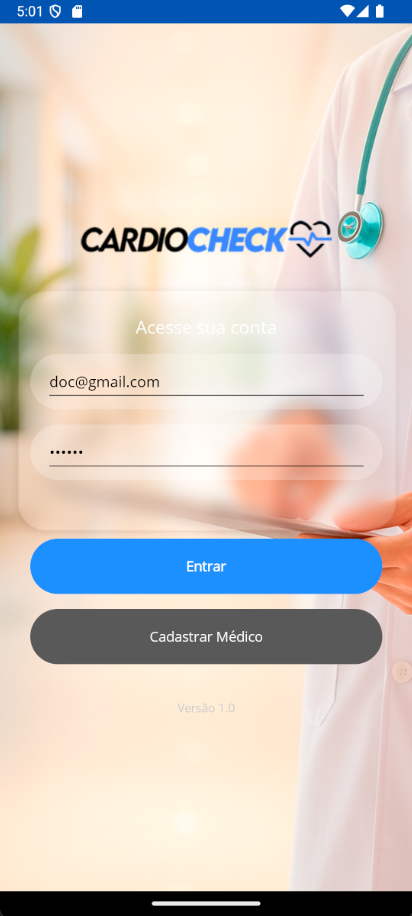
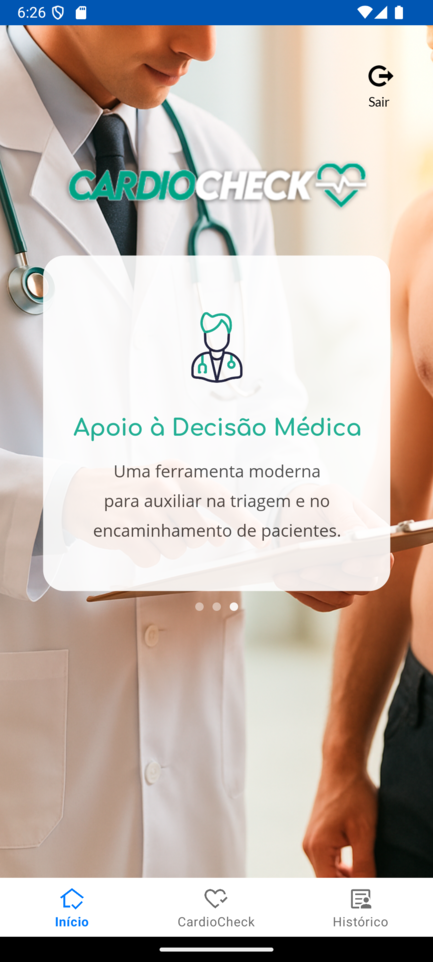
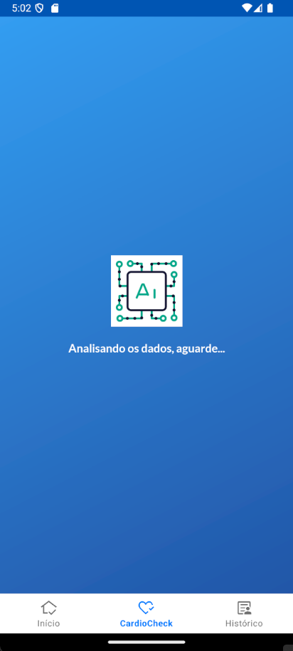
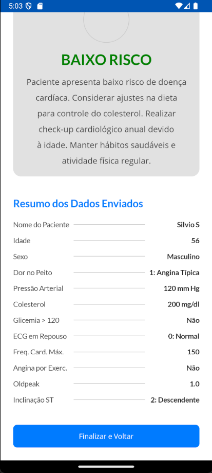
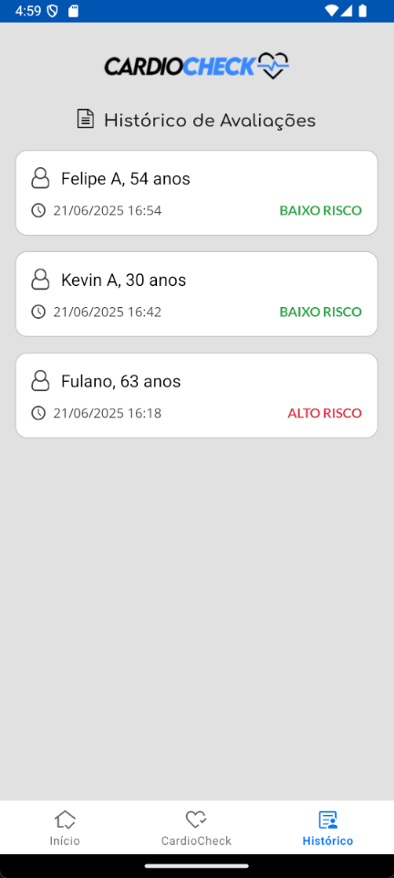
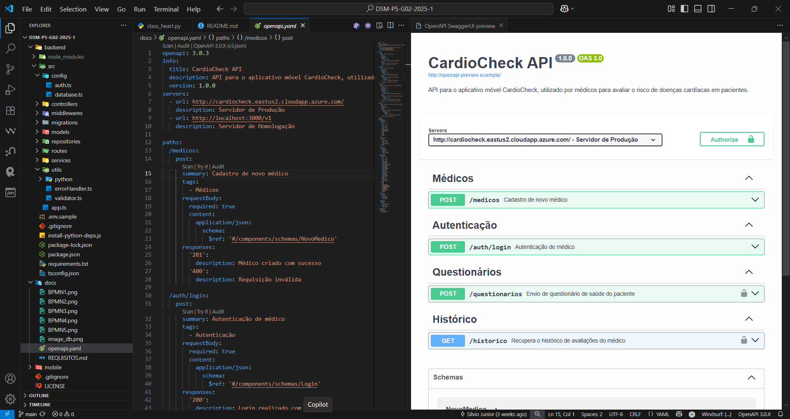

# CardioCheck - Aplicação Mobile para Verificação de Risco Cardíaco

## 🚀 Visão Geral do Projeto

O CardioCheck é um sistema composto por uma aplicação móvel e uma API de backend, projetado para auxiliar médicos na avaliação de risco de doenças cardíacas em pacientes. A aplicação utiliza um modelo de inteligência artificial para processar dados de saúde inseridos pelo médico, como idade, pressão arterial, colesterol e resultados de exames, fornecendo uma classificação de risco (baixo ou alto) e recomendações apropriadas.

**Participantes do Grupo:**

  * GIAN CARLO FAVA
  * FELIPE FERREIRA REZENDE
  * KEVIN DE ALMEIDA BRANDAO
  * SILVIO ALVES DA SILVA JUNIOR

## ✨ Principais Funcionalidades

  * **Cadastro e Autenticação de Médicos:** O sistema permite que médicos se cadastrem e façam login de forma segura para acessar as funcionalidades.
  * **Questionário de Saúde Detalhado:** Coleta de 11 fatores de risco para doenças cardíacas, incluindo dados demográficos, resultados de exames e sintomas do paciente.
  * **Análise com Inteligência Artificial:** Os dados do questionário são enviados para a API, que utiliza um modelo de IA em Python para classificar o risco do paciente.
  * **Visualização de Resultados:** A aplicação exibe o resultado da análise (ALTO RISCO ou BAIXO RISCO) de forma clara, juntamente com recomendações médicas baseadas no perfil do paciente.
  * **Histórico de Avaliações:** Médicos podem consultar o histórico de todas as avaliações realizadas para acompanhar os pacientes.

## 🛠️ Arquitetura e Tecnologias

O sistema é dividido em três componentes principais:

1.  **Aplicação Mobile (Frontend):**

      * Desenvolvida em **C\#** com o framework **.NET MAUI**, garantindo compatibilidade com a plataforma Android.
      * Responsável pela interface do usuário, coleta de dados e comunicação com o backend.

2.  **API (Backend):**

      * Construída em **Node.js** com **Express** e **TypeScript**.
      * Utiliza **TypeORM** para a comunicação com o banco de dados **MySQL**.
      * Gerencia o cadastro de médicos, autenticação via **JWT (JSON Web Token)** e o processamento dos questionários.
      * Orquestra a chamada ao modelo de IA para obter as predições.

3.  **Modelo de Inteligência Artificial:**

      * Um script em **Python** (`class_heart.py`) que utiliza bibliotecas como **scikit-learn**, **pandas** e **numpy**.
      * Carrega um modelo de classificação pré-treinado (`heart_modelo_lda.joblib`) para realizar a predição de risco cardíaco.

## 🌐 Ambiente de Produção (Online)

O backend do projeto está hospedado na nuvem e pode ser acessado publicamente através do seguinte endereço:

  * **URL da API:** `http://cardiocheck.eastus2.cloudapp.azure.com/`

Para conectar o aplicativo mobile a este ambiente, utilize o endereço acima no arquivo de configuração da API.

## ⚙️ Como Executar o Projeto Localmente

Siga os passos abaixo para configurar e executar o ambiente de desenvolvimento em sua máquina local.

### **Backend (API)**

1.  **Navegue até o diretório do backend:**

    ```bash
    cd backend
    ```

2.  **Crie o arquivo de ambiente:**
    Copie o conteúdo de `.env.sample` para um novo arquivo chamado `.env` e ajuste as variáveis de ambiente, como as credenciais do banco de dados MySQL.

3.  **Instale as dependências do Node.js:**

    ```bash
    npm install
    ```

4.  **Instale as dependências do Python:**
    O projeto utiliza um script para instalar as dependências Python automaticamente após a instalação do Node.js. Caso não funcione, instale manualmente:

    ```bash
    pip install -r requirements.txt
    ```

5.  **Execute a API em modo de desenvolvimento:**

    ```bash
    npm run dev
    ```

    O servidor será iniciado, por padrão, na porta `3000`.

### **Mobile (Aplicativo .NET MAUI)**

1.  **Abra o projeto:**
    Abra o arquivo de solução `CardioCheck.sln` ou o projeto `CardioCheck.csproj` localizado no diretório `mobile/CardioCheck` utilizando o Visual Studio.

2.  **Configure o Endereço da API:**
    No arquivo `SessaoLogin.cs`, verifique se a `UrlApi` está configurada corretamente.

      * **Para usar o backend online:** Aponte para `http://cardiocheck.eastus2.cloudapp.azure.com/v1`
      * **Para usar o backend local (emulador Android):** Aponte para `http://10.0.2.2:3000/v1`. Este endereço IP é um alias para o `localhost` da máquina que está executando o emulador.

3.  **Compile e Execute:**
    Selecione o dispositivo ou emulador Android desejado e execute o projeto a partir do Visual Studio.

## 📋 Endpoints da API

A API, documentada com `openapi.yaml`, expõe os seguintes endpoints principais (prefixados com `/v1`):

  * `POST /medicos`: Realiza o cadastro de um novo médico no sistema.
  * `POST /auth/login`: Autentica um médico utilizando email e senha, retornando um token de acesso.
  * `POST /questionarios`: Recebe os dados do questionário de saúde do paciente, processa através do modelo de IA e retorna o resultado da avaliação.
  * `GET /historico`: Retorna a lista de avaliações já realizadas pelo médico autenticado.

# Imagens do APP, API e AI

###       Video APP
   

### Imagens APP
   
   



   



# Video AI
   

# API
