# HealthCheck - Plataforma de Avaliação de Saúde e Sono

### 📹 [Vídeo no YouTube](https://youtu.be/HyWEk_p2UE0)

## 🚀 Visão Geral do Projeto

O **HealthCheck** é uma evolução do projeto CardioCheck, transformando-se em uma plataforma abrangente de saúde. O sistema agora combina duas funcionalidades principais: **avaliação de risco cardíaco** e **análise da qualidade do sono**.

A solução utiliza Inteligência Artificial para processar dados clínicos e comportamentais, fornecendo classificações de risco e recomendações personalizadas tanto para a saúde cardiovascular quanto para padrões de sono.

**Participantes do Grupo:**
* GIAN CARLO FAVA
* FELIPE FERREIRA REZENDE
* KEVIN DE ALMEIDA BRANDAO
* SILVIO ALVES DA SILVA JUNIOR


## ✨ Funcionalidades Principais

### ❤️ Módulo Cardíaco
* **Questionário de Saúde:** Coleta de 11 fatores de risco (pressão arterial, colesterol, ECG, etc.).
* **IA Preditiva:** Classificação de risco (Baixo ou Alto) utilizando modelos de Machine Learning.
* **Recomendações:** Orientações médicas baseadas no perfil de risco.

### 💤 Módulo de Sono (Novo)
* **Análise de Qualidade:** Avaliação baseada em duração, nível de estresse, IMC e atividade física.
* **Detecção de Distúrbios:** Identificação de padrões compatíveis com Insônia ou Apneia do Sono.
* **Score de Sono:** Pontuação de 1 a 10 para qualidade do sono.

### 💻 Funcionalidades Gerais
* **Multiplataforma:** Acesso via **App Mobile** (Android) e **Web** (Navegador).
* **Autenticação Segura:** Login para médicos com JWT.
* **Histórico:** Visualização de avaliações anteriores de ambos os módulos.


## 🛠️ Arquitetura e Tecnologias

O sistema evoluiu para uma arquitetura distribuída, utilizando mensageria para processamento assíncrono das avaliações de IA.


### 1. Interfaces (Frontend)
* **Mobile:** Desenvolvido em **.NET MAUI (C#)** para Android.
* **Web:** Desenvolvido em **React (Vite + TypeScript)** para navegadores.

### 2. Backend (API Gateway)
* **Tecnologia:** Node.js com Express e TypeScript.
* **Banco de Dados:** MySQL gerenciado via TypeORM.
* **Função:** Gerencia autenticação, persistência de dados e orquestra as solicitações para a fila de mensagens.

### 3. Inteligência Artificial (Workers)
* **Tecnologia:** Python (Scikit-learn, Pandas).
* **Funcionamento:** Scripts "Consumers" que escutam filas do NATS, processam os modelos preditivos (`.joblib`) e retornam os resultados.
    * `ia_consumer_heart.py`: Processa dados cardíacos.
    * `ia_consumer_sleep.py`: Processa dados de sono.

### 4. Infraestrutura e Mensageria
* **NATS:** Sistema de mensageria para comunicação assíncrona entre a API e os Workers Python.
* **Docker:** Utilizado para containerização do serviço de mensageria (NATS).

## 🌐 Ambiente de Produção (Online)

O backend do projeto está hospedado na nuvem e pode ser acessado publicamente através do seguinte endereço:

* **URL da API:** `http://healthcheck.eastus2.cloudapp.azure.com/api`

Para conectar o aplicativo mobile a este ambiente, utilize o endereço acima no arquivo de configuração da API.

## 📋 Endpoints da API

A API segue o padrão REST e os endpoints estão documentados no arquivo `docs/openapi.yaml`. Abaixo os principais recursos disponíveis:

### 🔐 Autenticação e Médicos
| Método | Endpoint | Descrição |
|---|---|---|
| `POST` | `/v1/medicos` | Realiza o cadastro de um novo médico no sistema. |
| `POST` | `/v1/auth/login` | Autentica um médico e retorna o token JWT de acesso. |

### ❤️ Questionários
| Método | Endpoint | Descrição |
|---|---|---|
| `POST` | `/v1/questionarios/coracao` | Envia questionário cardíaco para análise de risco via IA. |
| `POST` | `/v1/questionarios/sono` | Envia questionário de sono para análise de qualidade via IA. |

### 📂 Histórico
| Método | Endpoint | Descrição |
|---|---|---|
| `GET` | `/v1/historico/coracao` | Retorna o histórico de avaliações cardíacas do médico logado. |
| `GET` | `/v1/historico/sono` | Retorna o histórico de avaliações de sono do médico logado. |

---

## ⚙️ Como Executar o Projeto Localmente

### Pré-requisitos
* Node.js e Yarn/NPM
* Python 3.x
* .NET SDK (para Mobile)
* Docker (para o NATS)
* MySQL

### Passo 1: Infraestrutura (NATS)
Na raiz do projeto, suba o serviço de mensageria:
```bash
docker-compose up -d
````

### Passo 2: Backend (API)

1.  Acesse a pasta `backend`:
    ```bash
    cd backend
    ```
2.  Configure o `.env` (baseado no `.env.sample`).
3.  Instale as dependências e rode as migrações:
    ```bash
    npm install
    npm run typeorm migration:run -d ./src/config/database.ts
    ```
4.  Inicie o servidor:
    ```bash
    npm run dev
    ```

### Passo 3: Workers de IA (Python)

Para que as avaliações funcionem, os consumidores Python precisam estar rodando para processar as mensagens da fila.

1.  Acesse a pasta `ia`:
    ```bash
    cd ia
    ```
2.  Instale as dependências:
    ```bash
    pip install -r requirements.txt
    ```
3.  Execute os consumidores (em terminais separados):
    ```bash
    # Terminal A - Consumidor Cardíaco
    python heart/ia_consumer_heart.py

    # Terminal B - Consumidor de Sono
    python sleep/ia_consumer_sleep.py
    ```

### Passo 4: Frontend Web

1.  Acesse a pasta `frontend`:
    ```bash
    cd frontend
    ```
2.  Instale e execute:
    ```bash
    npm install
    npm run dev
    ```

### Passo 5: Mobile (.NET MAUI)

1.  Abra o projeto `mobile/CardioCheck/CardioCheck.sln` no Visual Studio.
2.  No arquivo `SessaoLogin.cs` (ou configuração equivalente), aponte a URL da API para o seu IP local (ex: `http://10.0.2.2:3000/v1` para emulador Android).
3.  Execute o projeto em um emulador Android.


## 🌐 Ambiente de Produção

  * **URL da API:** `http://healthcheck.eastus2.cloudapp.azure.com/`
  * A documentação da API pode ser consultada via Swagger/OpenAPI em `docs/openapi.yaml`.


## 🖼️ Galeria

### Aplicação Mobile e Web

#### Mobile
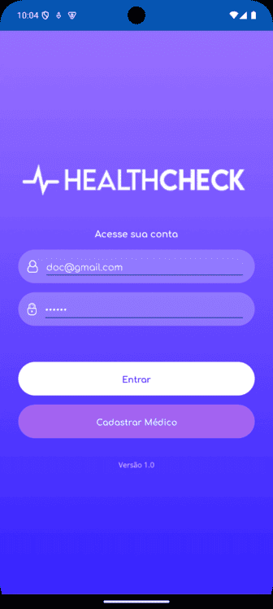

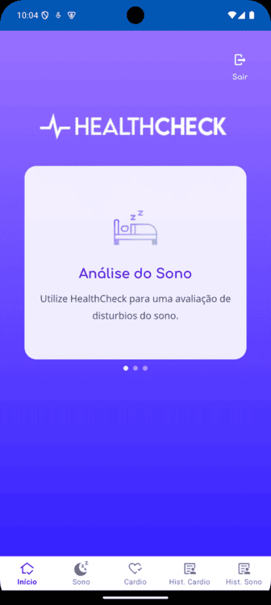

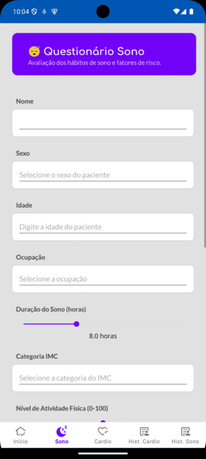

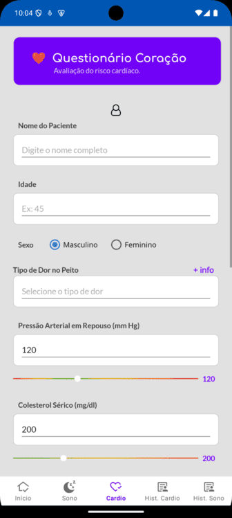

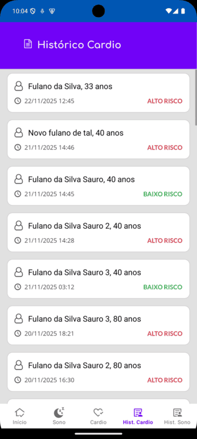

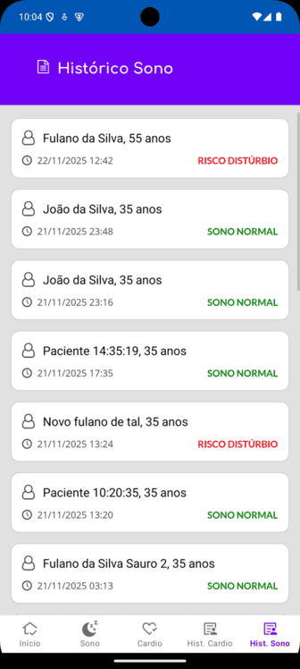

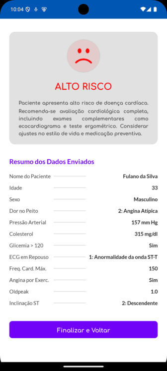

#### Web

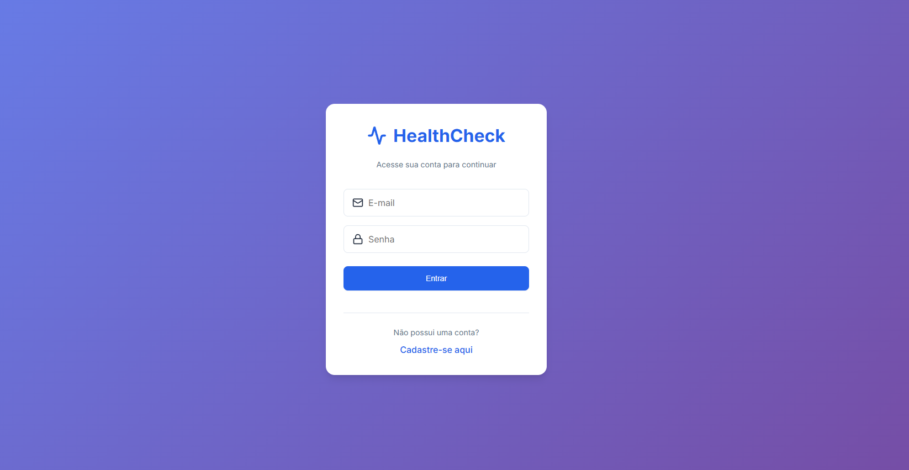


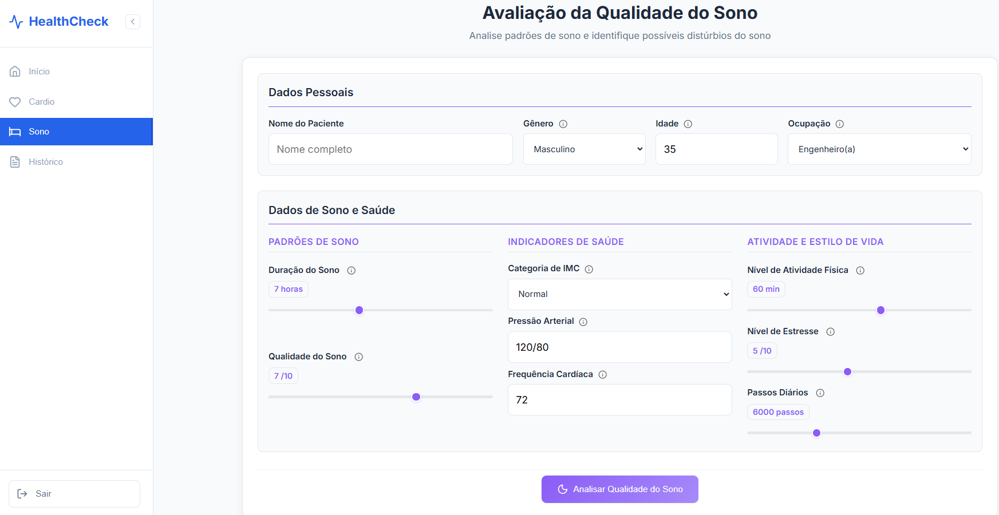


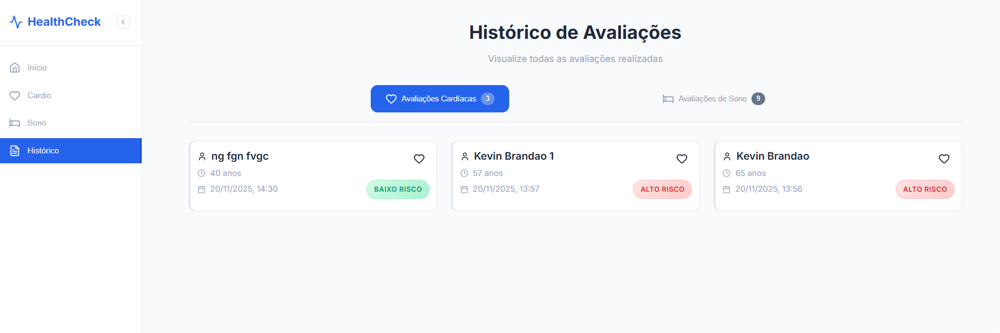

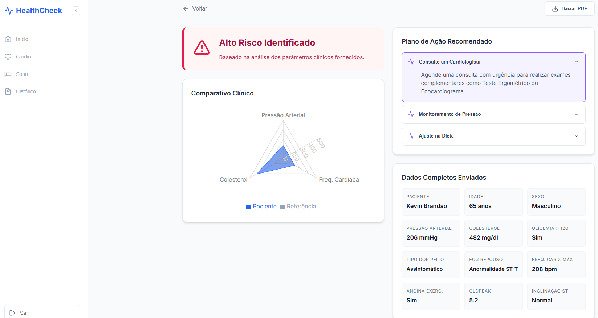
